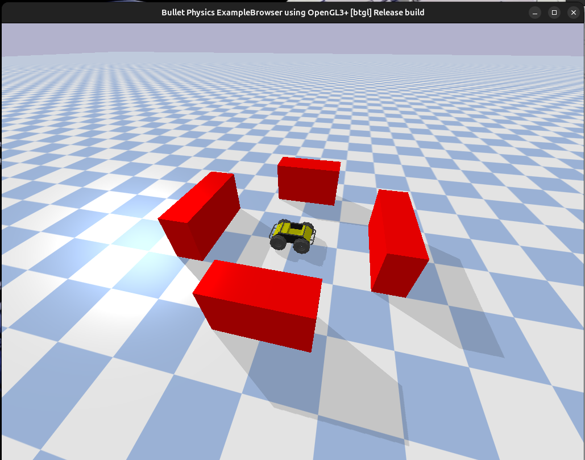
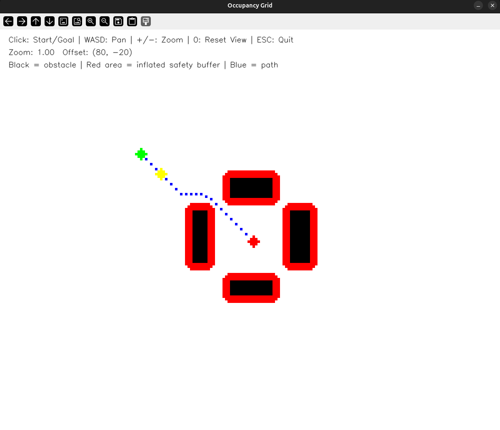
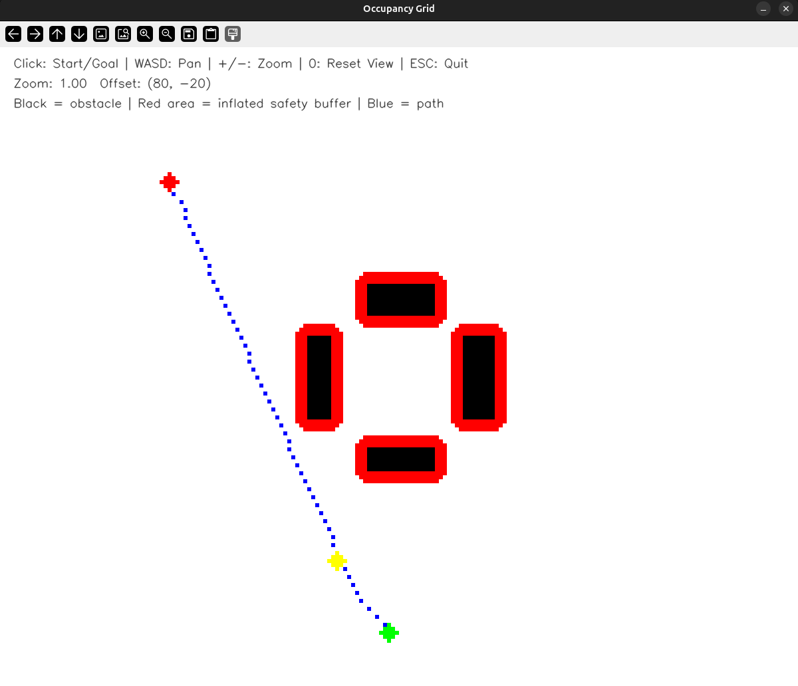
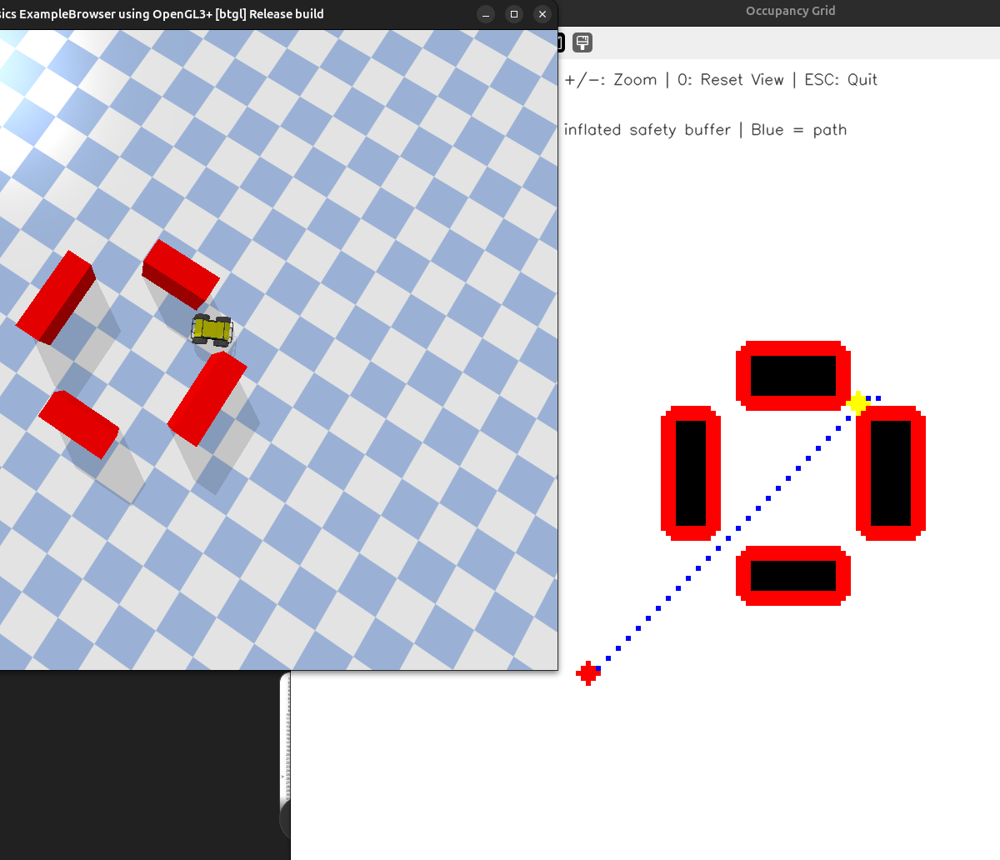

# 🤖 Interactive Autonomous Navigation using Husky — PyBullet (No ROS)

## 📌 Overview

This project implements an **interactive autonomous navigation system** for the **Clearpath Husky robot** using **PyBullet**, without using ROS or any prebuilt navigation stacks.

It includes:

* Interactive GUI for selecting start and goal positions
* A* path planning with obstacle avoidance
* Closed-loop motion control
* Autonomous navigation in a simulated environment

The system integrates **simulation, planning, control, and visualization** into a complete robotics pipeline.

---

## ⚙️ System Specifications

| Parameter          | Value                 |
| ------------------ | --------------------- |
| Robot              | Clearpath Husky       |
| Simulation Engine  | PyBullet              |
| GUI Framework      | OpenCV                |
| Planning Algorithm | A* (8-connected grid) |
| Map Type           | Occupancy Grid        |
| Control Type       | Differential Drive    |
| Feedback           | Closed-loop           |

---

## 🧱 Project Structure

```
husky_nav_assignment/
 └── src/
     ├── simulator/
     │   └── pybullet_sim.py
     │
     ├── planner/
     │   └── grid_planner.py
     │
     ├── controller/
     │   └── motion_controller.py
     │
     ├── gui/
     │   └── map_gui.py
     │
     └── main.py
```

---

## 🚀 Setup Instructions

```bash
git clone https://github.com/sachinsuvarna15/husky-autonomous-navigation.git
cd ~/husky-autonomous-navigation
pip install -r requirements.txt
```

---

## Create and activate virtual environment (Recommended)

```bash
python3 -m venv venv
source venv/bin/activate
```
---

## ▶️ Run Instructions

```bash
python main.py
```

---

## 🕹️ Controls

| Action     | Input             |
| ---------- | ----------------- |
| Set Start  | First mouse click |
| Set Goal   | Second click      |
| Reset      | Third click       |
| Pan        | W / A / S / D     |
| Zoom       | + / -             |
| Reset View | 0                 |
| Exit       | ESC               |

---

## 🧠 System Components

---

### 1. Simulation

* Husky robot loaded in PyBullet
* Custom obstacle course using box primitives
* Differential drive motion using wheel velocities
* Real-time physics simulation

---

### 2. GUI (OpenCV)

* Interactive occupancy grid visualization
* Displays:

  * Start (green)
  * Goal (red)
  * Path (blue)
  * Robot (yellow)
* Supports pan and zoom navigation

---

### 3. Path Planning (A*)

* Grid-based A* algorithm
* 8-connected movement (including diagonals)
* Relaxed diagonal constraints for better navigation
* Cost-aware planning:

  * Penalizes proximity to obstacles
  * Prefers safer and more central paths

---

### 4. Control System

Closed-loop controller using robot pose feedback.

Control logic:

```
heading_error = target_heading - current_yaw
```

Behavior:

* Rotate toward waypoint
* Move forward when aligned
* Reduce speed near goal
* Smooth turning using angular velocity control

---

### 5. Obstacle Handling

* Occupancy grid built from obstacles
* Obstacle inflation for safety margin
* Stuck detection using low movement condition
* Recovery behavior:

  * Move backward
  * Turn
  * Replan path

---

## 🔄 Path Planning Logic

A* cost function:

```
f(n) = g(n) + h(n) + obstacle_penalty
```

Where:

* `g(n)` = path cost
* `h(n)` = heuristic (Euclidean distance)
* `obstacle_penalty` = proximity cost

This ensures:

* Shortest path
* Safe distance from obstacles
* Effective use of gaps (including diagonal paths)

---

## 📸 Results

Screenshots included:



* Husky robot in PyBullet environment

.png)

* GUI with occupancy grid




* Path planning and path visualization



* Robot following planned trajectory

---

## 📊 Features Implemented

### Core Requirements

* ✅ Husky simulation in PyBullet
* ✅ GUI-based start and goal selection
* ✅ Autonomous path planning
* ✅ Closed-loop control system
* ✅ Obstacle detection and avoidance

---

### Bonus Features

* ✅ Path visualization
* ✅ Replanning when stuck
* ✅ Obstacle inflation (safety buffer)
* ✅ Cost-aware A* planning
* ⚠️ Partial trajectory smoothing

---

## ⚠️ Limitations

* Static environment (no dynamic obstacles)
* Motion not fully smooth (no trajectory optimization)
* Grid resolution limits precision

---

## 🔮 Future Improvements

* Smooth trajectory tracking (Pure Pursuit)
* Dynamic obstacle avoidance
* SLAM-based mapping
* Multi-goal navigation

---

## ✅ Conclusion

This project demonstrates a complete **autonomous navigation system** built from scratch without ROS.

It successfully integrates:

* Simulation
* GUI interaction
* Path planning
* Control system
* Obstacle handling

It highlights strong **system design, modular architecture, and practical robotics implementation skills**.
